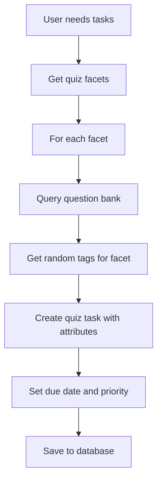
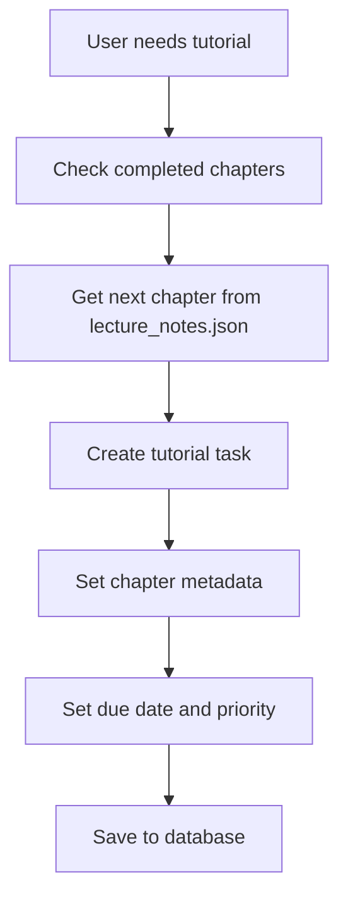

# SAT Task Management System

## Overview

The SAT Task Management System is a comprehensive solution for assigning, tracking, and managing study tasks for SAT exam preparation. The system automatically creates personalized weekly learning journeys with a mix of quiz tasks and AI tutorial sessions.

## Table of Contents

1. [Architecture](#architecture)
2. [Task Types](#task-types)
3. [Task Assignment Logic](#task-assignment-logic)
4. [API Endpoints](#api-endpoints)
5. [Database Structure](#database-structure)
6. [Task Creation Process](#task-creation-process)
7. [Usage Examples](#usage-examples)
8. [Configuration](#configuration)

## Architecture

### Core Components

```
┌─────────────────────────────────────────────────────────────────┐
│                        Task Management System                    │
├─────────────────────────────────────────────────────────────────┤
│  API Layer (routes/task_routing.py)                            │
│  ├── GET /user/{id}/tasks - Get all tasks                      │
│  ├── GET /user/{id}/tasks/current - Get next task              │
│  ├── POST /user/{id}/tasks/{task_id}/complete - Mark complete  │
│  └── GET /user/{id}/dashboard - Get dashboard data             │
├─────────────────────────────────────────────────────────────────┤
│  Service Layer (helper/task_service.py)                        │
│  ├── TaskService - Main service class                          │
│  ├── Task assignment and retrieval                             │
│  └── Progress tracking and analytics                           │
├─────────────────────────────────────────────────────────────────┤
│  Business Logic (helper/task_assignment.py)                    │
│  ├── Weekly task assignment logic                              │
│  ├── Quiz and tutorial task creation                           │
│  └── Day-based task distribution                               │
├─────────────────────────────────────────────────────────────────┤
│  Data Layer (database/task_db.py)                              │
│  ├── TaskDatabase - Database operations                        │
│  ├── Batch operations and queries                              │
│  └── Analytics and reporting                                   │
├─────────────────────────────────────────────────────────────────┤
│  Models (models/task_schema.py)                                │
│  └── Task - Core task data structure                           │
└─────────────────────────────────────────────────────────────────┘
```

## Task Types

### 1. Quiz Tasks
- **Purpose**: Test knowledge in specific SAT subject areas
- **Duration**: 10 minutes each
- **Questions**: 10 questions per quiz
- **Difficulty**: Level 3 (standardized)
- **Passing Score**: 70%
- **Facets Covered**:
  - `math|algebra|11` - Algebra concepts
  - `math|data analysis|11` - Data analysis and statistics
  - `reading & writing|grammar|11` - Grammar rules and usage
  - `reading & writing|vocabulary|11` - Vocabulary and word meanings

### 2. AI Tutorial Tasks
- **Purpose**: Interactive learning sessions with AI tutor
- **Duration**: ~30 minutes each
- **Content**: Based on SAT preparation chapters from `config/lecture_notes.json`
- **Progression**: Sequential chapter completion
- **Chapters Available**:
  1. General Information about SAT
  2. Basic Principles
  3. Reading & Writing Mastery
  4. Reading Detective Strategy
  5. Craft & Structure Mastery
  6. Information & Ideas Arsenal
  7. RW Power-Ups

## Task Assignment Logic

### Weekly Assignment Strategy

The system assigns tasks based on the current day of the week:

#### Full Week Assignment (Monday-Wednesday)
- **4 Quiz Tasks** (one for each facet)
- **2 AI Tutorial Tasks** (next uncompletedchapters)
- **Total**: 6 tasks distributed across the week

#### Mid-Week Assignment (Thursday-Saturday)
- **2 Quiz Tasks** (prioritized facets)
- **1 AI Tutorial Task**
- **Total**: 3 tasks for remaining days

#### Weekend Assignment (Sunday)
- **1 Quiz Task**
- **1 AI Tutorial Task**
- **Total**: 2 tasks

### Task Distribution Algorithm

```python
def assign_weekly_tasks(user: User, current_date: datetime = None) -> List[Task]:
    """
    1. Calculate days left in current week
    2. Determine task count based on remaining days
    3. Create quiz tasks from predefined facets
    4. Create AI tutorial tasks from next unfinished chapters
    5. Distribute due dates evenly across remaining days
    """
```

### Quiz Task Creation Process



### AI Tutorial Task Creation Process



## API Endpoints

### Get User Tasks
```http
GET /api/tasks/user/{user_id}/tasks
```
**Response:**
```json
{
  "success": true,
  "tasks": [
    {
      "id": "task_uuid",
      "title": "Algebra Quiz",
      "description": "Complete a quiz with 10 algebra questions",
      "type_of_task": "quiz",
      "subject": "Math",
      "due_date": "2025-10-10T23:59:59Z",
      "completed": false,
      "task_number": 1,
      "quiz_related_attributes": {
        "facet": "math|algebra|11",
        "tags": ["linear_equations", "quadratic_equations"],
        "num_questions": 10,
        "difficulty_level": 3,
        "duration_minutes": 10,
        "passing_score": 70.0
      },
      "attempts_info": {
        "attempts": 0,
        "best_score": null
      }
    }
  ],
  "count": 6
}
```

### Get Current Task
```http
GET /api/tasks/user/{user_id}/tasks/current
```
**Response:**
```json
{
  "success": true,
  "current_task": {
    "id": "task_uuid",
    "title": "Algebra Quiz",
    "type_of_task": "quiz",
    "due_date": "2025-10-10T23:59:59Z",
    "is_overdue": false,
    "days_until_due": 3
  }
}
```

### Complete Task
```http
POST /api/tasks/user/{user_id}/tasks/{task_id}/complete
Content-Type: application/json

{
  "score": 85.0,
  "attempt_data": {
    "time_taken_minutes": 8,
    "correct_answers": 9,
    "total_questions": 10
  }
}
```

### Get Dashboard Data
```http
GET /api/tasks/user/{user_id}/dashboard
```
**Response:**
```json
{
  "success": true,
  "dashboard": {
    "analytics": {
      "total_tasks": 6,
      "completed_tasks": 2,
      "pending_tasks": 4,
      "overdue_tasks": 0,
      "completion_rate": 33.33,
      "quiz_tasks": 4,
      "tutorial_tasks": 2
    },
    "next_task": {
      "id": "next_task_uuid",
      "title": "Grammar Quiz",
      "due_date": "2025-10-09T23:59:59Z"
    },
    "upcoming_due_dates": [
      {
        "task_id": "task1",
        "title": "Grammar Quiz",
        "due_date": "2025-10-09T23:59:59Z",
        "days_until_due": 2
      }
    ]
  }
}
```

## Database Structure

### Firestore Collections

```
users/
├── {user_id}/
│   ├── completed_chapters: string[]
│   ├── current_week_start: timestamp
│   └── tasks/
│       └── {task_id}/
│           ├── id: string
│           ├── title: string
│           ├── description: string
│           ├── type_of_task: "quiz" | "AI Tutorial"
│           ├── subject: string
│           ├── due_date: timestamp
│           ├── completed: boolean
│           ├── task_number: number
│           ├── quiz_related_attributes: object
│           ├── ai_tutorial_related_attributes: object
│           ├── attempts_info: object
│           ├── start_date_of_week: timestamp
│           └── created_at: timestamp

question_bank/
├── _metadata/
│   └── facets: object
└── {facet}/
    └── difficulty/
        └── {level}/
            └── ...
```

## Task Creation Process

### 1. User Registration/Login Flow

```python
# When user is created or logs in
async def handle_user_login(user_id: str):
    user = get_user_by_id(user_id)
    
    # Check if tasks need to be assigned
    if should_assign_new_tasks(user):
        # Assign tasks for current week
        tasks = await initialize_user_tasks(user)
        return tasks
    
    # Return existing tasks
    return await fetch_current_tasks(user)
```

### 2. Weekly Task Assignment

```python
def assign_weekly_tasks(user: User) -> List[Task]:
    # 1. Calculate week boundaries
    week_start = get_week_start()
    days_left = get_days_left_in_week()
    
    # 2. Determine task distribution
    if days_left >= 4:  # Full week
        quiz_count, tutorial_count = 4, 2
    elif days_left >= 2:  # Mid week
        quiz_count, tutorial_count = 2, 1
    else:  # Weekend
        quiz_count, tutorial_count = 1, 1
    
    # 3. Create quiz tasks
    quiz_facets = get_quiz_facets()
    quiz_tasks = []
    for i, facet in enumerate(quiz_facets[:quiz_count]):
        task = create_quiz_task(
            user_id=user.id,
            facet_info=facet,
            task_number=i + 1,
            due_date=calculate_due_date(i, days_left),
            week_start=week_start
        )
        quiz_tasks.append(task)
    
    # 4. Create AI tutorial tasks
    tutorial_tasks = []
    for i in range(tutorial_count):
        next_chapter = user.get_next_chapter()
        if next_chapter:
            task = create_ai_tutorial_task(
                user_id=user.id,
                chapter_id=next_chapter,
                task_number=len(quiz_tasks) + i + 1,
                due_date=calculate_due_date(len(quiz_tasks) + i, days_left),
                week_start=week_start
            )
            tutorial_tasks.append(task)
    
    return quiz_tasks + tutorial_tasks
```

### 3. Quiz Task Creation Details

```python
def create_quiz_task(user_id: str, facet_info: Dict, task_number: int, 
                    due_date: datetime, week_start: datetime) -> Task:
    # Get tags from question bank
    tags = get_random_tags_for_facet(facet_info["facet"], 10)
    
    # Create task with quiz attributes
    return Task.create_quiz_task(
        title=facet_info["title"],
        description=f"Complete a {facet_info['title']} with 10 questions",
        due_date=due_date,
        task_number=task_number,
        user_id=user_id,
        subject=Subject(facet_info["subject"]),
        facet=facet_info["facet"],
        tags=tags,
        num_questions=10,
        difficulty_level=3,
        duration_minutes=10,
        passing_score=70.0,
        start_date_of_week=week_start
    )
```

### 4. AI Tutorial Task Creation Details

```python
def create_ai_tutorial_task(user_id: str, chapter_id: str, task_number: int,
                           due_date: datetime, week_start: datetime) -> Task:
    # Load chapter info from lecture notes
    lecture_notes = load_lecture_notes()
    chapter_info = lecture_notes["SAT"]["chapters"][chapter_id]
    
    return Task.create_ai_tutorial_task(
        title=f"AI Tutorial: {chapter_info['title']}",
        description=f"Complete tutorial for {chapter_info['title']}",
        due_date=due_date,
        task_number=task_number,
        user_id=user_id,
        chapter_id=chapter_id,
        chapter_title=chapter_info['title'],
        start_date_of_week=week_start,
        estimated_duration_minutes=30
    )
```

## Usage Examples

### Initialize Tasks for New User

```python
from helper.task_service import initialize_user_tasks
from models.users_schema import User

user = User(id="user123", email="test@example.com", name="Test User")
tasks = await initialize_user_tasks(user, firestore_client)

print(f"Created {len(tasks)} tasks for user {user.name}")
for task in tasks:
    print(f"- {task.title} (Due: {task.due_date.date()})")
```

### Check User Progress

```python
from helper.task_service import get_user_dashboard_data

dashboard = await get_user_dashboard_data(user, firestore_client)
analytics = dashboard['analytics']

print(f"Completion Rate: {analytics['completion_rate']}%")
print(f"Tasks: {analytics['completed_tasks']}/{analytics['total_tasks']}")
print(f"Next Task: {dashboard['next_task']['title'] if dashboard['next_task'] else 'None'}")
```

### Mark Task Complete

```python
from helper.task_service import TaskService

task_service = TaskService(firestore_client)
success = await task_service.mark_task_completed("user123", "task456")

if success:
    print("Task marked as completed!")
```

## Configuration

### Quiz Facets Configuration

The quiz facets are hardcoded in `helper/task_assignment.py`:

```python
def get_quiz_facets() -> List[Dict[str, str]]:
    return [
        {"facet": "math|algebra|11", "subject": "Math", "title": "Algebra Quiz"},
        {"facet": "math|data analysis|11", "subject": "Math", "title": "Data Analysis Quiz"},
        {"facet": "reading & writing|grammar|11", "subject": "Reading & Writing", "title": "Grammar Quiz"},
        {"facet": "reading & writing|vocabulary|11", "subject": "Reading & Writing", "title": "Vocabulary Quiz"}
    ]
```

### Lecture Notes Configuration

AI Tutorial content is loaded from `config/lecture_notes.json`:

```json
{
  "SAT": {
    "description": "SAT Test Preparation Materials",
    "subject": "SAT Preparation",
    "chapters": {
      "Chapter 1": {
        "title": "GENERAL INFORMATION ABOUT SAT",
        "notes": "...",
        "summary": "...",
        "key_insights": [...]
      }
    }
  }
}
```

### Task Assignment Parameters

Default task parameters can be modified in the create methods:

```python
# Quiz defaults
num_questions = 10
difficulty_level = 3
duration_minutes = 10
passing_score = 70.0

# Tutorial defaults
estimated_duration_minutes = 30
```

## Error Handling

The system includes comprehensive error handling:

- **Database Connection**: Graceful fallback when Firestore is unavailable
- **Question Bank**: Mock tags when question database is inaccessible
- **Task Assignment**: Fallback to minimal tasks if errors occur
- **API Responses**: Proper HTTP status codes and error messages

## Future Enhancements

1. **Monthly Task Assignment**: Extend to support monthly learning cycles
2. **Adaptive Difficulty**: Adjust task difficulty based on performance
3. **Custom Schedules**: Allow users to set preferred study times
4. **Progress Analytics**: Enhanced reporting and insights
5. **Reminder System**: Email/push notifications for due tasks
6. **Collaborative Features**: Study groups and peer comparison

## Troubleshooting

### Common Issues

1. **Tasks Not Appearing**: Check user's `current_week_start` field
2. **Duplicate Tasks**: Ensure `should_assign_new_tasks()` logic is correct
3. **Missing Question Tags**: Verify question bank database connection
4. **Chapter Not Found**: Check `lecture_notes.json` file structure

### Debug Endpoints

Use the admin endpoint to test task assignment:

```http
POST /api/tasks/admin/tasks/test-assignment
Content-Type: application/json

{
  "user_id": "test_user",
  "completed_chapters": ["Chapter 1", "Chapter 2"]
}
```

This comprehensive documentation covers the complete SAT Task Management System, from architecture to implementation details. The system provides a robust foundation for personalized SAT preparation with automatic task assignment and progress tracking.